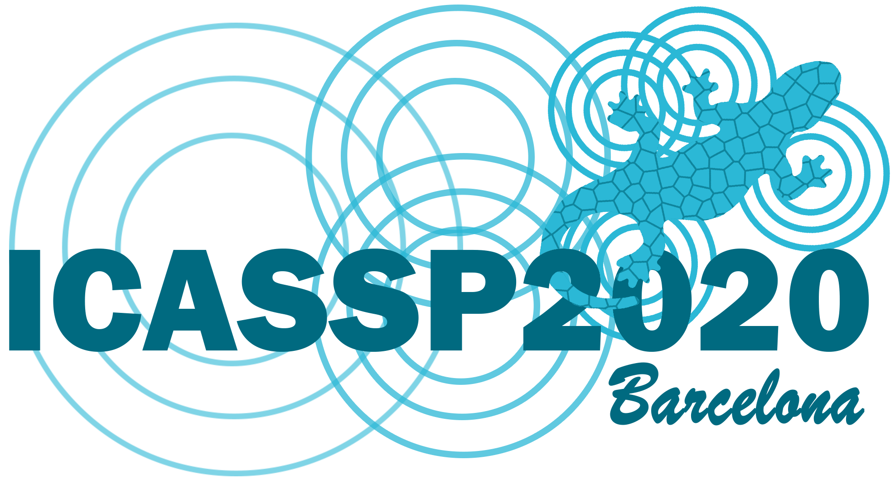

 

###### Acknowledgment - This work has been made possible by the [NSF grant award #CCF-1763747](https://www.nsf.gov/awardsearch/showAward?AWD_ID=1763747&HistoricalAwards=false)
-----

<h1 align="center">Neural Network Training with Approximate Logarithmic Computations</h1>

This repository contains code for the paper published, as well as instructions on how to install dependencies and run the code.

<link rel="stylesheet" href="https://cdn.rawgit.com/jpswalsh/academicons/master/css/academicons.min.css">
<link href="https://stackpath.bootstrapcdn.com/font-awesome/4.7.0/css/font-awesome.min.css" rel="stylesheet" integrity="sha384-wvfXpqpZZVQGK6TAh5PVlGOfQNHSoD2xbE+QkPxCAFlNEevoEH3Sl0sibVcOQVnN" crossorigin="anonymous">

    

## Abstract

The high computational complexity associated with training deep neural networks limits online and real-time training on edge devices. This paper proposed an end-to-end training and inference scheme that eliminates multiplications by approximate operations in the log-domain which has the potential to significantly reduce implementation complexity. We implement the entire training procedure in the log-domain, with fixed-point data representations. This training procedure is inspired by hardware-friendly approximations of log-domain addition which are based on look-up tables and bit-shifts. We show that our 16-bit log-based training can achieve classification accuracy within approximately 1% of the equivalent floating-point baselines for a number of commonly used data-sets.

### About ICASSP

ICASSP is **the world’s largest and most comprehensive technical conference focused on signal processing and its applications**. As of January 2020, it is ranked by google metrics #1 in the domain of *Accoustics & Sound* and #4 in the domain of *Signal Processing* (top 3 in *Signal Processing* are *IEEE Transactions*)

* ICASSP has an h5-index of **80** and an h5-median of **140**
* ICASSP 2020 will be held in Barcelona between May 4 2020 and May 8 2020.

### Cite this work

If you use our code as benchmark/comparison in a scientific publication, we would appreciate references to our published paper:

	@misc{sanyal2019neural,
    	title={Neural Network Training with Approximate Logarithmic Computations},
    	author={Arnab Sanyal and Peter A. Beerel and Keith M. Chugg},
    	year={2019},
    	eprint={1910.09876},
    	archivePrefix={arXiv},
    	primaryClass={cs.LG}
	}

### Contact

* For discussions (bugs or no bugs) please use the chat room 
* For bugs in particular, feel free to open a [**GitHub Issue**](https://github.com/arnabsanyal/lnsdnn/issues)
* Please email me in case you face difficulties [arnabsan@usc.edu](mailto:arnabsan@usc.edu)

## Installing python 3

## Installing Dependencies

## Training Multilayer Perceptron models

### References

<a href="#"><i class="ai ai-ieee ai-5x"></i></a><a href="https://arxiv.org/abs/1910.09876"><i class="ai ai-arxiv ai-5x"></i></a> <a href="https://towardsdatascience.com/neural-networks-training-with-approximate-logarithmic-computations-44516f32b15b"><i class="fa fa-medium fa-5x"></i></a>

-----

* [**More about the author**](https://arnabsanyal.github.io/website)
* [**Hardware Accelerated Learning Research Group, USC**](https://hal.usc.edu/)
