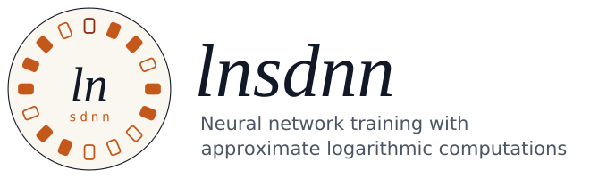
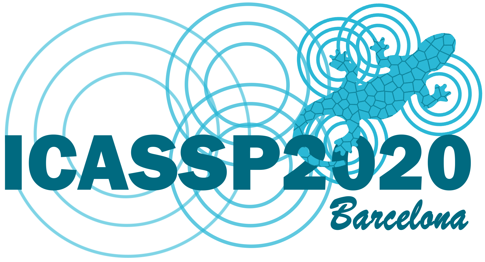
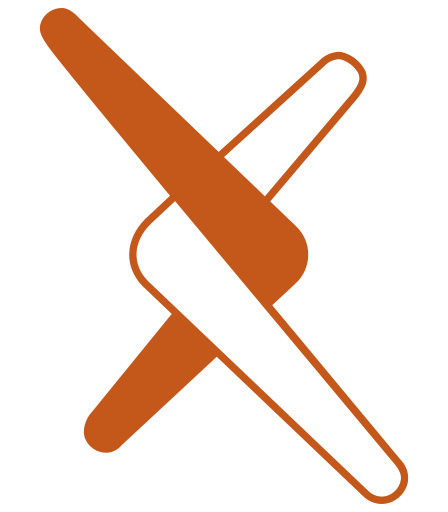

  <picture>
    <source media="(prefers-color-scheme: dark)" srcset="assets/lnsdnn-header-dark.svg">
    
  </picture>

  
  
  
  
  

###### Acknowledgment - This work has been made possible by the [NSF grant award #CCF-1763747](https://www.nsf.gov/awardsearch/showAward?AWD_ID=1763747&HistoricalAwards=false)
-----

This repository contains code for the ICASSP 2020 paper [*Neural Network Training with Approximate Logarithmic Computations*](https://arxiv.org/abs/1910.09876), as well as instructions on how to install dependencies and run the code.

## Abstract

The high computational complexity associated with training deep neural networks limits online and real-time training on edge devices. This paper proposed an end-to-end training and inference scheme that eliminates multiplications by approximate operations in the log-domain which has the potential to significantly reduce implementation complexity. We implement the entire training procedure in the log-domain, with fixed-point data representations. This training procedure is inspired by hardware-friendly approximations of log-domain addition which are based on look-up tables and bit-shifts. We show that our 16-bit log-based training can achieve classification accuracy within approximately 1% of the equivalent floating-point baselines for a number of commonly used data-sets.

### About ICASSP

ICASSP is **the world’s largest and most comprehensive technical conference focused on signal processing and its applications**. As of January 2024, it is ranked by google metrics #1 in the domain of *Accoustics & Sound*, #3 in the domain of *Signal Processing* and #13 in the domain of *Physics & Mathematics*.

* ICASSP has an h5-index of **80** and an h5-median of **140**
* ICASSP 2020 will be held in Barcelona between May 4 2020 and May 8 2020.

### Cite this work

If you use our code as benchmark/comparison in a scientific publication, we would appreciate references to our published paper:

	@inproceedings{sanyal2019neural,
    	author={A. {Sanyal} and P. A. {Beerel} and K. M. {Chugg}},
  		booktitle={ICASSP 2020 - 2020 IEEE International Conference on Acoustics, Speech and Signal Processing (ICASSP)}, 
  		title={{Neural Network Training with Approximate Logarithmic Computations}}, 
  		year={2020},
  		pages={3122-3126},
  		doi={10.1109/ICASSP40776.2020.9053015},
  		ISSN={2379-190X},
  		month={May},
  		url={https://doi.org/10.1109/ICASSP40776.2020.9053015}
	}

### Contact

* For discussions (bugs or no bugs) please use the chat room 
* For bugs in particular, feel free to open a [**GitHub Issue**](https://github.com/arnabsanyal/lnsdnn/issues)
* Please email me in case you face difficulties [sanyal@utexas.edu](mailto:sanyal@utexas.edu)

## Installing Dependencies

Install [Miniconda](https://docs.conda.io/en/latest/miniconda.html) (or Anaconda); the conda environment below provides Python and every other dependency.

The trained models (`src/**/*.npz`) are stored with [Git LFS](https://git-lfs.com). Install it before cloning, or run `git lfs install && git lfs pull` in an existing clone; without it the model files are small text pointers and inference fails to load them. The datasets are not in the repository; they are downloaded from Google Drive (see below).

The conda environment files are in [`setup/`](setup). Create and activate the environment, then install the log-domain kernels from inside the activated environment. This builds the OpenMP log-multiplier C extension (`native_matr_mult_wrapper`) and installs it together with its Python wrapper (`dnn_log_misc`):

	conda env create -f setup/environment.yml
	conda activate lnsdnn
	cd src && python setup.py install

[`setup/environment-py37.yml`](setup/environment-py37.yml) provides the same environment on Python 3.7; see the comments at the top of that file for Apple Silicon Macs.

## Training Multilayer Perceptron models

Each experiment lives in `src/<experiment>/<dataset>/train.py`, with datasets `mnist`, `fmnist` (Fashion-MNIST), `emnistd` (EMNIST-Digits) and `emnistl` (EMNIST-Letters). The scripts read the datasets from `src/datasets/`; download one first by running `python download_data.py` in the experiment folder (or the matching `download_*.py` script inside `src/datasets/`).

| Folder | Arithmetic |
| --- | --- |
| `1_baseline_floatingpoint` | linear domain, floating point |
| `2_baseline_fixedpoint` | linear domain, fixed point (`--bi`, `--bf`) |
| `3_log_floatingpoint` | log domain with look-up-table addition (`--table_size`, `--granularity`), floating point; trained models included |
| `4_log_fixedpoint` | log domain with look-up-table addition, fixed point (`--qi`, `--qf`); see `run.sh` for the 12/16-bit runs |

Run a script from its own folder. Without arguments it runs inference on the test set using the saved model in that folder; pass `--is_training True` to train (and save) a model first:

	cd src/3_log_floatingpoint/mnist
	python download_data.py               # fetch the MNIST dataset
	python train.py                      # inference with the included model
	python train.py --is_training True   # train from scratch

## TODO

The code release is not yet complete (the *upload completion* badge above tracks it). Still to do:

- [ ] **Re-host the datasets.** The Google Drive files behind `src/datasets/download_*.py` are no longer available (HTTP 404). Upload the original `.npz` files again and update the `file_id` in each script. The original MNIST file stores each image transposed; the included MNIST models expect that layout.
- [ ] **Handle Google Drive's large-file warning.** For large files (likely the EMNIST sets) Google Drive serves a virus-scan warning page, which the download scripts would save in place of the dataset.
- [ ] **Log-domain bit-shift experiments.** Code for the bit-shift approximation of log-domain addition (Table 1, *bit-shifts* columns) is not yet in `src/`.
- [ ] **Paper's look-up-table configuration.** The paper uses a 20-entry table (dmax = 10, r = 1/2) for all operations and a 640-entry table (r = 1/64) for a log-domain soft-max. `4_log_fixedpoint` currently uses a single table and computes the soft-max in the linear domain.
- [ ] **Trained models for the remaining experiments.** `1_baseline_floatingpoint`, `2_baseline_fixedpoint` and `4_log_fixedpoint` have no saved models yet, so inference there requires training first.
- [ ] **`--is_training False` still trains.** The flag is parsed with `bool()`, so any non-empty value enables training; omit the flag to run inference.

## References

*  [IEEE Xplore](https://ieeexplore.ieee.org/document/9053015/) (ICASSP 2020)
*  [arXiv:1910.09876](https://arxiv.org/abs/1910.09876)
*  [Project web page](https://arnabsanyal.github.io/icassp2020/lnsdnn.html)
*  [Neural Networks Training with Approximate Logarithmic Computations](https://towardsdatascience.com/neural-networks-training-with-approximate-logarithmic-computations-44516f32b15b) (Towards Data Science on Medium)

-----

  <picture>
    <source media="(prefers-color-scheme: dark)" srcset="assets/lnsdnn-mark-dark.svg">
    
  </picture>

* [**More about the author**](https://arnabsanyal.github.io)
* [**Hardware Accelerated Learning Research Group, USC**](https://hal.usc.edu/)
