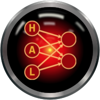

 

###### Acknowledgment - This work has been made possible by the [NSF grant award #CCF-1763747](https://www.nsf.gov/awardsearch/showAward?AWD_ID=1763747&HistoricalAwards=false)
-----

<h1 align="center">Neural Network Training with Approximate Logarithmic Computations</h1>

This repository contains code for the paper published, as well as instructions on how to install dependencies and run the code.

## Abstract

The high computational complexity associated with training deep neural networks limits online and real-time training on edge devices. This paper proposed an end-to-end training and inference scheme that eliminates multiplications by approximate operations in the log-domain which has the potential to significantly reduce implementation complexity. We implement the entire training procedure in the log-domain, with fixed-point data representations. This training procedure is inspired by hardware-friendly approximations of log-domain addition which are based on look-up tables and bit-shifts. We show that our 16-bit log-based training can achieve classification accuracy within approximately 1% of the equivalent floating-point baselines for a number of commonly used data-sets.

## Installing python 3

## Installing Dependencies

## Training Multilayer Perceptron models

#### About ICASSP

ICASSP is **the world’s largest and most comprehensive technical conference focused on signal processing and its applications**. As of January 2020, it is ranked by google metrics #1 in the domain of *Accoustics & Sound* and #4 in the domain of *Signal Processing* (top 3 in *Signal Processing* are *IEEE Transactions*)

* Today ICASSP has an h5-index of 80 and an h5-median of 140
* ICASSP 2020 will be held in Barcelona between May 4 2020 and May 8 2020.

### References

* [Arxiv link](https://arxiv.org/abs/1910.09876)
* [Research Blog link](https://towardsdatascience.com/neural-networks-training-with-approximate-logarithmic-computations-44516f32b15b)
* [Hardware Accelerated Learning Research Group, USC](https://hal.usc.edu/)
